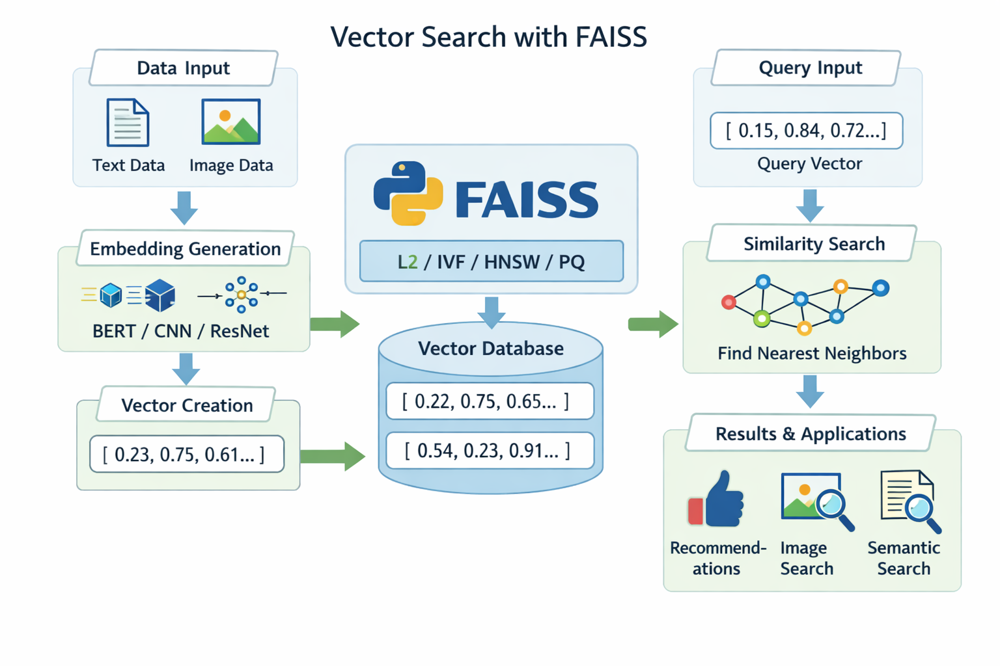

# faiss
faiss : Facebook AI Similarity Search | Meta | Numpy | Index | Search | k-Nearest Neigbours |

## Objective
This project demonstrates basic usage of [FAISS](https://github.com/facebookresearch/faiss) for similarity search.

## Features
- Create a FAISS index
- Add vectors to the index
- Perform similarity search
- Retrieve nearest neighbors

## Setup
```bash
git clone https://github.com/miozilla/faiss.git
cd faiss
pip install -r requirements.txt
```

## FAISS Demo




